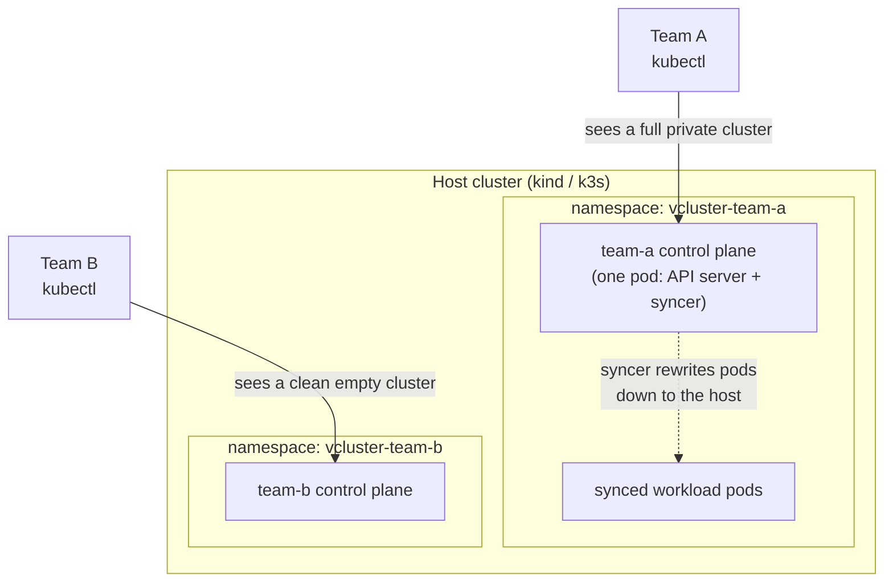

<div align="center">

# vcluster-labs

**Virtual Kubernetes clusters: The isolation of a real cluster at the cost of a namespace.**


</div>

A hands-on lab series that builds toward a miniature self-service developer
platform: every team gets its own Kubernetes cluster, provisioned by pull
request, all running on one cheap VPS.

---

## The problem

Every platform team faces the same tenancy dilemma:

| Approach | Cost | Isolation | The catch |
|---|---|---|---|
| Cluster per team | High (control plane fees, nodes, ops) | Full | ~20 min to provision, expensive to multiply |
| Namespace per team | Near zero | Weak | Shared CRDs, shared API server, shared k8s version, shared blast radius |
| **vcluster per team** | **~370 Mi RAM** | **Own API server, CRDs, RBAC, version** | This repo finds out |

A vcluster is a real Kubernetes control plane that runs as a pod inside a
host cluster. Tenants see a clean, private cluster. The host sees a namespace
with a couple of pods.

## How it works



The trick is the **syncer**: high-level objects (deployments, CRDs, RBAC)
live only inside the virtual API server, while low-level objects that need
real compute (pods, services) are copied to the host with rewritten names.
Run `kubectl get pods -A` on the host and you can see it happening:

```
NAMESPACE          NAME                                        READY
vcluster-team-a    team-a-0                                    1/1     <- the entire "cluster"
vcluster-team-a    podinfo-85b78f8fcc-x-demo-x-team-a          1/1     <- team-a's app, synced
vcluster-team-b    team-b-0                                    1/1
```

## Measured, not claimed

Numbers from Lab 01 on a laptop (Apple Silicon, Docker Desktop):

| Metric | Value |
|---|---|
| Create a vcluster | ~3 s to submit, ~35 s to ready |
| Memory per tenant control plane | ~370 Mi |
| CPU per idle tenant | ~75 m |
| Create the kind host cluster (once) | ~27 s |
| Create a managed cloud cluster (comparison) | ~20 min and ~$70+/month before nodes |

## The labs

| Lab | Status | What it proves |
|---|---|---|
| [01 - First vclusters](lab-01-first-vclusters/) | ✅ done | Two isolated tenants on one host, a real workload, and the syncer visible in action |
| 02 - Isolation proof | planned | Conflicting operator/CRD versions side by side, different k8s versions per tenant, blast-radius demo |
| 03 - Benchmarks | planned | The full speed/memory/cost table: vcluster vs kind vs managed clusters |
| 04 - Self-service platform | planned | Hetzner VPS via Terraform, ArgoCD ApplicationSet: a new team cluster is a merged PR to `tenants/` |
| 05 - Showcase | planned | A 10-minute demo script backed by all the evidence above |

## Quickstart

Prerequisites: Docker running, plus `kind`, `kubectl`, `helm`, and
[`vcluster`](https://www.vcluster.com/docs/get-started) on PATH.

```sh
cd lab-01-first-vclusters
./scripts/01-up.sh      # host cluster + two tenant vclusters + podinfo in team-a
./scripts/02-tour.sh    # interactive tour: tenant views, host view, memory cost
./scripts/99-down.sh    # delete everything
```

Total time: about five minutes. Teardown is complete, so experiment freely.

## Where this is going

The end state is a two-layer platform:

- **Platform layer** (Terraform, changes rarely): Hetzner VPS, k3s, ingress,
  DNS, ArgoCD.
- **Tenant layer** (GitOps, self-service): ArgoCD watches `tenants/` in this
  repo. A team opens a PR adding a five-line YAML file, a reviewer approves,
  and their cluster exists a minute after merge. Offboarding is `git rm`.
  The audit trail is `git log`.

Everything uses the Apache-2.0 open-source vcluster core. No commercial
platform required.
